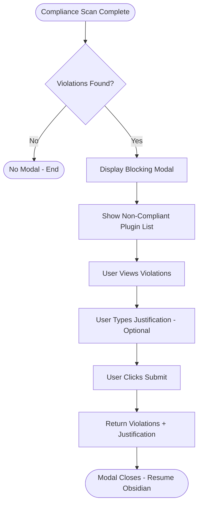

# UX Specification: Compliance Notification Modal

**Platform**: Desktop (Windows, macOS, Linux) + Mobile (iOS, Android) — Obsidian

## User Flow



**Exit Path Behaviors:**
- **Escape Key**: Blocked — modal cannot be dismissed without submitting
- **Click Outside**: Blocked — modal stays open
- **Submit**: Closes modal, returns justification text (may be empty) to caller

## Interaction Model

### Core Actions

- **submit_justification**
  ```json
  {
    "trigger": "User clicks Submit/Acknowledge button",
    "feedback": "Modal closes immediately",
    "success": "Justification text returned to caller for notification file",
    "error": "None — empty justification is valid"
  }
  ```

### States & Transitions
```json
{
  "hidden": "Modal not displayed — no violations or already submitted",
  "displaying": "Modal open showing violations list and justification input",
  "submitted": "User clicked submit — modal closing, justification captured"
}
```

## Quantified UX Elements

| Element | Formula / Source Reference |
|---------|----------------------------|
| Violation count | `complianceResult.violations.length` — displayed in modal header |
| Plugin list height | Scrollable when violations exceed visible area (10+ items) |

## Platform-Specific Patterns

### Desktop
- **Keyboard**: Tab between justification textarea and submit button; Enter does not submit (allows multiline)

### Mobile
- **Gestures**: Standard tap; on-screen keyboard for justification textarea
- **Keyboard**: Done/Return inserts newline in textarea; submit via button only

## Accessibility Standards

- **Screen Readers**: Modal announced with ARIA role="dialog" and aria-label; violation list items announced with plugin name and reason; submit button labeled
- **Navigation**: Tab moves focus between textarea and submit button; focus trapped within modal
- **Visual**: Inherits Obsidian theme contrast; violations list clearly separated from input area
- **Touch Targets**: Submit button minimum 44x44px on mobile

## Error Presentation

```json
{
  "network_failure": {
    "visual_indicator": "N/A — no network operations",
    "message_template": "N/A",
    "action_options": "N/A",
    "auto_recovery": "N/A"
  },
  "validation_error": {
    "visual_indicator": "N/A — no validation on justification (empty allowed)",
    "message_template": "N/A",
    "action_options": "N/A",
    "auto_recovery": "N/A"
  },
  "timeout": {
    "visual_indicator": "N/A — no async operations",
    "message_template": "N/A",
    "action_options": "N/A",
    "auto_recovery": "N/A"
  },
  "permission_denied": {
    "visual_indicator": "N/A — modal is local UI only",
    "message_template": "N/A",
    "action_options": "N/A",
    "auto_recovery": "N/A"
  }
}
```
