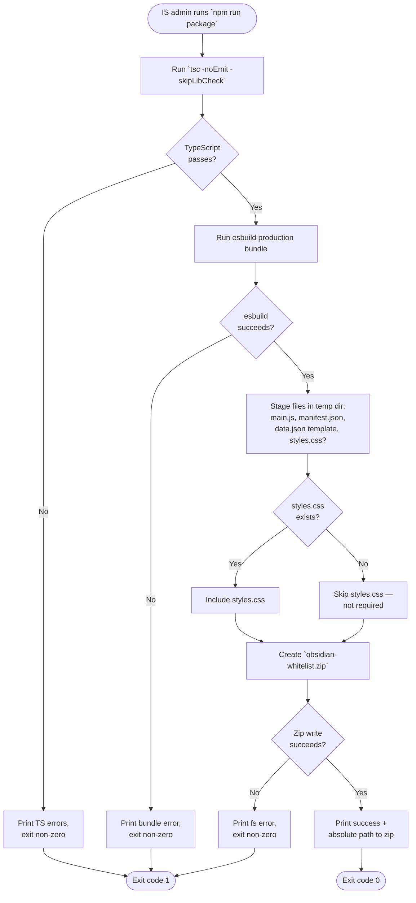

## UX Specification: Distribution Packaging

**Platform**: CLI / Build Tool (Node.js, invoked via `npm run package`)

## User Flow



**Exit Path Behaviors:**
- **TypeScript failure**: No zip is written. Any partially-staged files in the temp directory are removed. Working tree is unchanged. Exit code 1.
- **esbuild failure**: No zip is written. Temp staging directory is removed. Exit code 1.
- **Zip write failure**: Partial zip file (if any) is removed. Temp staging directory is removed. Exit code 1.
- **Ctrl+C / SIGINT**: Best-effort temp directory cleanup via `process.on("SIGINT")`. No partial zip persisted.

## Interaction Model

### Core Actions

- **run_package**
  ```json
  {
    "trigger": "User runs `npm run package` from the project root",
    "feedback": "Stdout streams progress: `tsc...`, `esbuild...`, `Packaging...`",
    "success": "Final line: `✓ Created obsidian-whitelist.zip (<size> bytes) at <absolute path>`",
    "error": "Stderr emits the failing tool's diagnostic; process exits non-zero"
  }
  ```

- **deploy_zip** (out-of-band, by IS admin)
  ```json
  {
    "trigger": "IS admin extracts the zip into a target vault's `.obsidian/plugins/obsidian-whitelist/`",
    "feedback": "Filesystem operation, no UI",
    "success": "On next Obsidian boot, plugin loads and the compliance scan runs against the bundled `data.json`",
    "error": "Obsidian shows its own plugin-load error in the developer console if any required file is missing"
  }
  ```

- **customize_template** (out-of-band, by IS admin)
  ```json
  {
    "trigger": "IS admin opens the bundled `data.json` and edits whitelist/blacklist/notificationDirectory before deployment",
    "feedback": "Plain text edit; no validation at edit time",
    "success": "On vault deployment, plugin loads with the customized settings",
    "error": "Malformed JSON causes Obsidian to fall back to defaults via `mergeSettings` (settings feature already handles this)"
  }
  ```

### States & Transitions
```json
{
  "idle": "User has not run the script",
  "compiling": "tsc -noEmit running; no zip yet",
  "bundling": "esbuild producing main.js into the temp staging directory",
  "staging": "Copying manifest.json, data.json template, and (optionally) styles.css into the temp directory",
  "zipping": "Writing obsidian-whitelist.zip to project root",
  "success": "Zip exists at project root; absolute path printed; exit 0",
  "failed": "One of compile/bundle/stage/zip steps failed; temp dir cleaned; exit 1"
}
```

## Quantified UX Elements

| Element | Formula / Source Reference |
|---------|----------------------------|
| Zip filename | `${manifest.id}.zip` (e.g., `obsidian-whitelist.zip`) — FR-006 |
| Zip size in success message | `fs.statSync(zipPath).size` (bytes), formatted with thousands separators |
| Success message path | `path.resolve(zipPath)` — absolute, copy-pasteable |
| Exit code on success | Literal `0` |
| Exit code on failure | Literal `1` |

## Platform-Specific Patterns

### Desktop / CLI
- **Window Management**: N/A — runs in the user's terminal session.
- **System Integration**: Inherits the parent shell's working directory and PATH. Honors `NODE_ENV` if the shell sets it (production bundle is unaffected by env, but tsc respects local `tsconfig.json`).
- **File System**: All output is project-relative. The zip is written to the project root next to `manifest.json`. Temp staging directory uses `os.tmpdir()` and is removed on exit (success or failure). No file is written outside the project root or the OS temp dir.

## Accessibility Standards

- **Screen Readers**: Output is plain stdout/stderr text — fully consumable by terminal screen readers (e.g., VoiceOver in Terminal.app, NVDA in Windows Terminal). No spinners or unicode-only progress UI; status lines use plain ASCII verbs (`Compiling`, `Bundling`, `Packaging`, `Created`).
- **Navigation**: N/A — non-interactive script. Ctrl+C is honored via the standard SIGINT handler; Ctrl+C aborts cleanly with temp cleanup.
- **Visual**: Color is OPTIONAL and only used for the final success/failure verb (`✓` / `✗`). Failure must ALSO be conveyed by exit code and the literal word `Error:` in the message — never by color alone. Contrast ratio is delegated to the user's terminal theme; contract is "must remain readable in monochrome (`NO_COLOR=1`)".
- **Touch Targets**: N/A — terminal interface.

## Error Presentation

```json
{
  "network_failure": {
    "visual_indicator": "N/A — script has no network calls; build is fully local",
    "message_template": "N/A",
    "action_options": "N/A",
    "auto_recovery": "N/A"
  },
  "validation_error": {
    "visual_indicator": "Stderr lines prefixed with `Error: TypeScript compilation failed` (FR-003); raw `tsc` diagnostics passed through verbatim",
    "message_template": "`Error: TypeScript compilation failed. Fix the errors above and re-run \\`npm run package\\`.`",
    "action_options": "User fixes the source files and re-runs the script",
    "auto_recovery": "None — exits non-zero immediately, leaves working tree untouched"
  },
  "timeout": {
    "visual_indicator": "N/A — synchronous local operations only; no timeouts defined",
    "message_template": "N/A",
    "action_options": "N/A",
    "auto_recovery": "N/A"
  },
  "permission_denied": {
    "visual_indicator": "Stderr line prefixed with `Error: cannot write` followed by the absolute path the script tried to write",
    "message_template": "`Error: cannot write <path>: <fs error code>. Check filesystem permissions and disk space, then re-run \\`npm run package\\`.`",
    "action_options": "User fixes permissions on the project root or temp dir and re-runs",
    "auto_recovery": "Temp staging directory is removed if it exists; no partial zip remains"
  }
}
```
