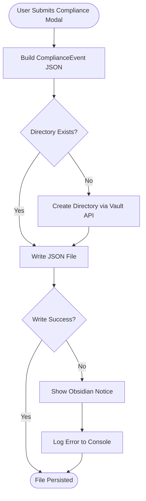

# UX Specification: IS Notification File

**Platform**: Desktop (Windows, macOS, Linux) + Mobile (iOS, Android) — Obsidian

## User Flow



**Exit Path Behaviors:**
- **No exit paths**: This is a background operation triggered by modal submit. No user interaction.

## Interaction Model

### Core Actions

- **write_compliance_notification**
  ```json
  {
    "trigger": "Automatic after user submits compliance modal",
    "feedback": "None on success — silent write. On failure: Obsidian Notice toast.",
    "success": "JSON file created in configured notification directory",
    "error": "Notice displayed with error message; plugin continues running"
  }
  ```

### States & Transitions
```json
{
  "idle": "No notification pending",
  "writing": "Building event JSON and writing to vault",
  "written": "File successfully persisted",
  "failed": "Write failed — notice shown, error logged"
}
```

## Quantified UX Elements

| Element | Formula / Source Reference |
|---------|----------------------------|
| Notification filename | `compliance-${ISO_TIMESTAMP}.json` where ISO_TIMESTAMP is `new Date().toISOString().replace(/[:.]/g, '-')` |
| File path | `${settings.notificationDirectory}/${filename}` (vault-relative) |

## Accessibility Standards

- **Screen Readers**: Error Notice uses Obsidian's built-in notice system (announced via aria-live) when a write failure occurs
- **Navigation**: Not applicable — background operation
- **Visual**: Not applicable — no UI beyond error Notice
- **Touch Targets**: Not applicable

## Error Presentation

```json
{
  "network_failure": {
    "visual_indicator": "N/A — uses Obsidian Vault API, local-only",
    "message_template": "N/A",
    "action_options": "N/A",
    "auto_recovery": "N/A"
  },
  "validation_error": {
    "visual_indicator": "N/A — no user input to validate",
    "message_template": "N/A",
    "action_options": "N/A",
    "auto_recovery": "N/A"
  },
  "timeout": {
    "visual_indicator": "N/A — synchronous local operation",
    "message_template": "N/A",
    "action_options": "N/A",
    "auto_recovery": "N/A"
  },
  "permission_denied": {
    "visual_indicator": "Obsidian Notice toast at top of screen",
    "message_template": "Failed to write compliance notification: [error message]",
    "action_options": "User checks vault permissions and directory accessibility",
    "auto_recovery": "None — error logged to console; plugin continues without crashing"
  }
}
```
