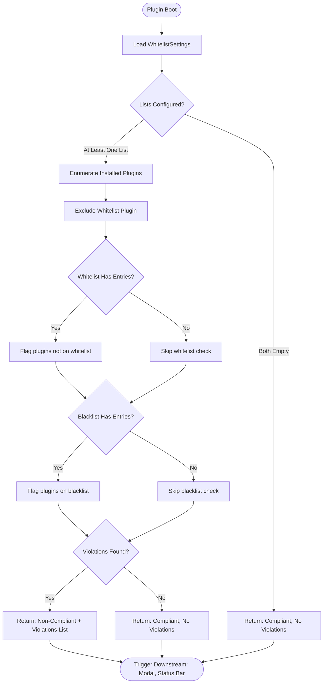

# UX Specification: Plugin Compliance Scan

**Platform**: Desktop (Windows, macOS, Linux) + Mobile (iOS, Android) — Obsidian

## User Flow



**Exit Path Behaviors:**
- **No exit paths**: This is a synchronous boot-time process with no user interaction. It always completes and returns a result.

## Interaction Model

### Core Actions

- **run_compliance_scan**
  ```json
  {
    "trigger": "Automatic — plugin onload (boot time)",
    "feedback": "None — runs before UI is available to user",
    "success": "ComplianceResult produced and passed to downstream features (modal, status bar, notification file)",
    "error": "If plugin enumeration fails, return compliant with empty violations (fail open)"
  }
  ```

### States & Transitions
```json
{
  "idle": "Plugin not yet loaded — scan has not run",
  "scanning": "Enumerating plugins and checking against lists",
  "complete_compliant": "Scan finished — no violations found",
  "complete_non_compliant": "Scan finished — violations found, result includes violation list"
}
```

## Quantified UX Elements

| Element | Formula / Source Reference |
|---------|----------------------------|
| Violation count | `complianceResult.violations.length` — passed to status bar indicator |
| Plugins scanned | `Object.keys(app.plugins.manifests).length - 1` (minus self) |

## Accessibility Standards

- **Not applicable**: This feature has no user-facing UI. It is a background process that produces data consumed by other features (compliance-notification-modal, status-bar-indicator).

## Error Presentation

```json
{
  "network_failure": {
    "visual_indicator": "N/A — no network operations",
    "message_template": "N/A",
    "action_options": "N/A",
    "auto_recovery": "N/A"
  },
  "validation_error": {
    "visual_indicator": "N/A — no user input",
    "message_template": "N/A",
    "action_options": "N/A",
    "auto_recovery": "N/A"
  },
  "timeout": {
    "visual_indicator": "N/A — synchronous local operation",
    "message_template": "N/A",
    "action_options": "N/A",
    "auto_recovery": "N/A"
  },
  "permission_denied": {
    "visual_indicator": "N/A — reads plugin manifests via Obsidian API (always available)",
    "message_template": "N/A",
    "action_options": "N/A",
    "auto_recovery": "N/A"
  }
}
```
