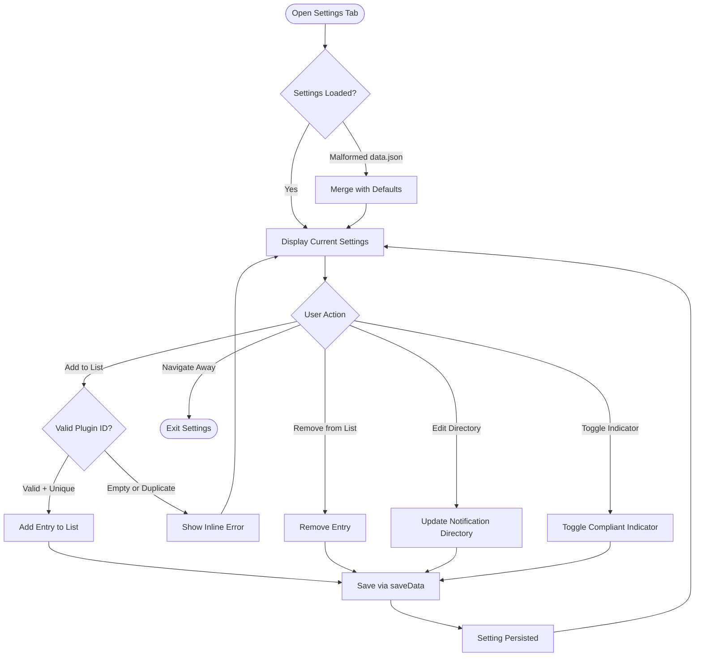

# UX Specification: Plugin Settings

**Platform**: Desktop (Windows, macOS, Linux) + Mobile (iOS, Android) — Obsidian

## User Flow



**Exit Path Behaviors:**
- **Navigate Away**: No cleanup needed — all changes persisted immediately on each action via `saveData()`
- **Close Settings**: Same as navigate away — no unsaved state possible

## Interaction Model

### Core Actions

- **add_plugin_to_list**
  ```json
  {
    "trigger": "User types plugin ID into text input and clicks add button (or presses Enter)",
    "feedback": "New entry appears in the whitelist or blacklist below the input",
    "success": "Settings saved, entry visible in list",
    "error": "Inline message if ID is empty or already in the list"
  }
  ```

- **remove_plugin_from_list**
  ```json
  {
    "trigger": "User clicks remove/delete button next to a list entry",
    "feedback": "Entry removed from visible list immediately",
    "success": "Settings saved with entry removed",
    "error": "Notice displayed if save fails"
  }
  ```

- **edit_notification_directory**
  ```json
  {
    "trigger": "User modifies the text field for notification directory path",
    "feedback": "Text field updates as user types",
    "success": "Settings saved on blur/change with new directory path",
    "error": "Falls back to default if path is empty on next boot"
  }
  ```

- **toggle_compliant_indicator**
  ```json
  {
    "trigger": "User clicks the toggle switch for show-compliant-indicator",
    "feedback": "Toggle visually flips immediately",
    "success": "Settings saved, status bar updates to show/hide compliant indicator",
    "error": "Notice displayed if save fails"
  }
  ```

### States & Transitions
```json
{
  "loading": "Plugin startup — loading data.json and merging with defaults",
  "displaying": "Settings tab open — current configuration visible and editable",
  "saving": "Transient — persisting change via saveData() after each action",
  "closed": "Settings tab not visible — settings remain persisted in data.json"
}
```

## Quantified UX Elements

| Element | Formula / Source Reference |
|---------|----------------------------|
| Whitelist entry count | `settings.whitelist.length` — displayed as section header count |
| Blacklist entry count | `settings.blacklist.length` — displayed as section header count |
| Default notification directory | Constant: `.obsidian-whitelist/notifications/` — defined in settings defaults |

## Platform-Specific Patterns

### Desktop
- **Keyboard**: Tab between settings fields; Enter to confirm add; standard Obsidian settings keyboard navigation

### Mobile
- **Gestures**: Standard tap interactions; Obsidian settings tab renders natively on mobile
- **Keyboard**: On-screen keyboard appears for text input fields; Enter/Done to confirm

## Accessibility Standards

- **Screen Readers**: ARIA roles inherit from Obsidian's PluginSettingTab framework; list entries announced with plugin ID text; toggle announced with on/off state
- **Navigation**: Tab key moves between input fields, list entries, and toggle; Enter key confirms add action; standard Obsidian settings tab navigation
- **Visual**: Inherits Obsidian's theme contrast ratios (meets WCAG AA 4.5:1 for text); error messages use distinct color from normal text
- **Touch Targets**: Minimum 44x44px for add/remove buttons and toggle on mobile (Obsidian's default component sizing)

## Error Presentation

```json
{
  "network_failure": {
    "visual_indicator": "Not applicable — all operations are local file I/O",
    "message_template": "N/A",
    "action_options": "N/A",
    "auto_recovery": "N/A"
  },
  "validation_error": {
    "visual_indicator": "Inline text below the input field, using Obsidian's setting description style",
    "message_template": "Plugin ID cannot be empty / Plugin ID already exists in this list",
    "action_options": "User corrects input and retries",
    "auto_recovery": "Error clears when user modifies input"
  },
  "timeout": {
    "visual_indicator": "Not applicable — all operations are synchronous local saves",
    "message_template": "N/A",
    "action_options": "N/A",
    "auto_recovery": "N/A"
  },
  "permission_denied": {
    "visual_indicator": "Obsidian Notice (toast) at top of screen",
    "message_template": "Failed to save settings. Check file permissions for the plugin directory.",
    "action_options": "User verifies file system permissions and retries",
    "auto_recovery": "None — requires manual intervention"
  }
}
```
