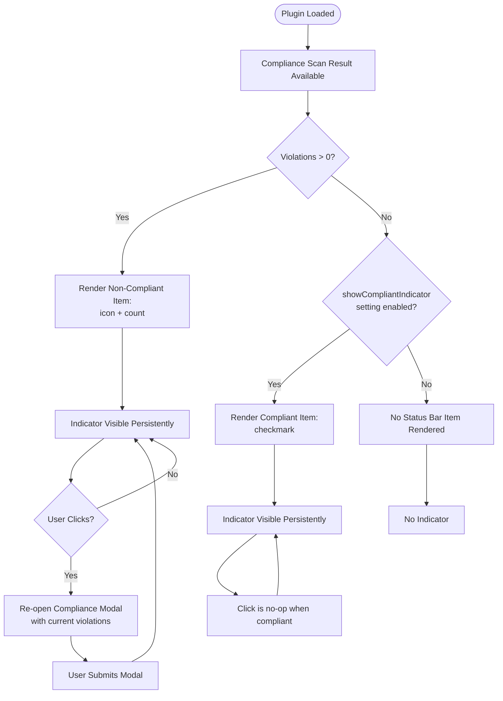

## UX Specification: Status Bar Indicator

**Platform**: Desktop + Mobile (Obsidian Plugin)

## User Flow



**Exit Path Behaviors:**
- **Plugin Unload**: Status bar item removed via Obsidian `setting.remove()` / element cleanup; no persistent state to flush.
- **Modal Close (from click)**: Modal handles its own lifecycle; status bar item remains visible and unchanged.
- **Settings Toggle Off (compliant state)**: Indicator immediately removed from DOM on next render cycle; non-compliant indicators are unaffected.

## Interaction Model

### Core Actions

- **render_indicator**
  ```json
  {
    "trigger": "Plugin boot completes compliance scan, or settings change",
    "feedback": "Status bar item appears/updates within current paint cycle",
    "success": "Correct icon + label visible in Obsidian status bar",
    "error": "If status bar API unavailable (mobile view), silently skip render — no error surfaced"
  }
  ```

- **click_indicator**
  ```json
  {
    "trigger": "User clicks status bar item while in non-compliant state",
    "feedback": "Compliance modal opens immediately (no loading state)",
    "success": "Modal displays current violation list and justification input",
    "error": "If violations list is empty (race condition), click is no-op"
  }
  ```

### States & Transitions
```json
{
  "uninitialized": "Plugin booting; no item rendered yet",
  "non_compliant": "Violations present; warning indicator always visible; clickable",
  "compliant_visible": "Zero violations; setting enabled; checkmark visible; non-clickable",
  "compliant_hidden": "Zero violations; setting disabled; no item in status bar"
}
```

## Quantified UX Elements

| Element | Formula / Source Reference |
|---------|----------------------------|
| Violation count display | `complianceState.violations.length` (formalized in data-model.md) |
| Indicator label (non-compliant) | `` `Non-compliant (${count})` `` — count from violations array |
| Indicator label (compliant) | Static literal `"Compliant"` with checkmark glyph |

## Platform-Specific Patterns

### Desktop
- **Window Management**: Status bar item attached to main Obsidian window via `addStatusBarItem()`; persists across workspace layout changes.
- **System Integration**: N/A — uses Obsidian's status bar abstraction, not OS-level tray.

### Mobile
- **Gestures**: Tap = click; no long-press menu. Status bar may not be visible on all mobile views — feature degrades silently when `addStatusBarItem` returns no element.
- **Offline**: Fully offline; no network dependency.

## Accessibility Standards

- **Screen Readers**: Status bar item assigned `role="button"` when non-compliant, `role="status"` when compliant. `aria-label` set to full text (e.g., `"Non-compliant: 3 plugin violations. Click to view."`). Use `aria-live="polite"` for state changes after initial render.
- **Navigation**: Indicator focusable via Tab when clickable (non-compliant state). Enter and Space keys trigger modal open. Escape within modal returns focus to indicator.
- **Visual**: Warning state must use Obsidian CSS variable `--text-warning` (or `--text-error`); contrast ratio ≥ 4.5:1 against `--status-bar-background`. Icon (e.g., `alert-triangle`) accompanies text — never color-only signaling.
- **Touch Targets**: Minimum 44×44 CSS pixels on mobile (achieved via padding on the status bar item element); desktop inherits Obsidian default click target.

## Error Presentation

```json
{
  "network_failure": {
    "visual_indicator": "N/A — feature has no network calls",
    "message_template": "N/A",
    "action_options": "N/A",
    "auto_recovery": "N/A"
  },
  "validation_error": {
    "visual_indicator": "N/A — no user input on this surface",
    "message_template": "N/A",
    "action_options": "N/A",
    "auto_recovery": "N/A"
  },
  "timeout": {
    "visual_indicator": "N/A — synchronous render based on already-resolved scan state",
    "message_template": "N/A",
    "action_options": "N/A",
    "auto_recovery": "N/A"
  },
  "permission_denied": {
    "visual_indicator": "Status bar item silently absent if `addStatusBarItem()` is unavailable on the current Obsidian view (e.g., some mobile contexts)",
    "message_template": "(none — silent degradation per UX-002 conciseness requirement)",
    "action_options": "User can still access compliance state via the modal triggered at boot",
    "auto_recovery": "Indicator will appear automatically on next view that supports the status bar"
  }
}
```
